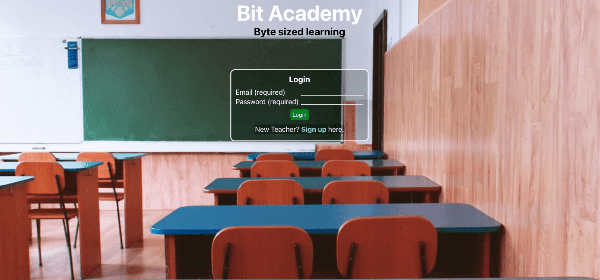

# Bit Academy

New and improved Bit Academy site.

Check out the deployed [app](https://bit-academy-cloud.wm.r.appspot.com/)

App based on my groups final project before graduation. [Original project](https://github.com/niles87/Project3) unfortunately the site is no longer up and running.

A Web Resource for the Education System. With Bit Academy we aim to deliver a robust app that eases the user experience and makes connecting a breeze in the digital age. Utilizing seperate teacher and student portals, users will be able to assign/submit assignments and chat live via webcam. We hope you enjoy our demonstration of Bit Academy and see the reliablity of it's use as we would love for you to consider it for your use in your education system.

## Technology Used

React Typescript 
Socket.io
GraphQL
MongoDB

Google Cloud Platform - hosting
